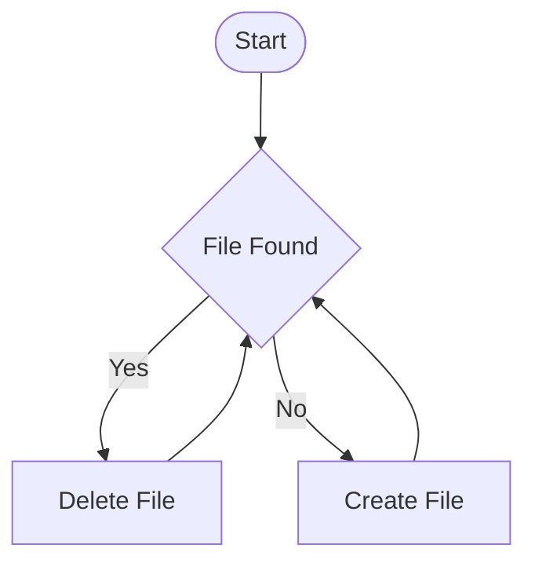

[](https://github.com/michimussato/OpenStudioLandscapes)

---

<!-- TOC -->
* [Openstudiolandscapes-Dagster-Showcase](#openstudiolandscapes-dagster-showcase)
  * [Install into OpenStudioLandscapes-Dagster](#install-into-openstudiolandscapes-dagster)
  * [Automation and Functionality](#automation-and-functionality)
<!-- TOC -->

---

# Openstudiolandscapes-Dagster-Showcase

## Install into OpenStudioLandscapes-Dagster

> [!TIP]
> 
> This package is already integrated into the default
> `config.yml`.

The following code snippet is added to the
`dagster_code_locations` section in the `config.yml` file of
[OpenStudioLandscapes-Dagster](https://github.com/michimussato/OpenStudioLandscapes-Dagster#default-configuration):

```yaml
dagster_code_locations:
  load_from:
  # [...]
  - python_module:
      location_name: OpenStudioLandscapes-Dagster-Showcase Package Code Location
      module_name: OpenStudioLandscapes.Dagster.Showcase.definitions
      working_directory: src
      pip_path: OpenStudioLandscapes-Dagster-Showcase @ git+https://github.com/michimussato/OpenStudioLandscapes-Dagster-Showcase.git@main
  # [...]
```

## Automation and Functionality

This is a dummy showcase Dagster package for the 
[OpenStudioLandscapes-Dagster](https://github.com/michimussato/OpenStudioLandscapes-Dagster) Feature. 
It does nothing productive:



However, the project implements Dagster sensors just to show that I can do it's
work autonously - without human interaction.
